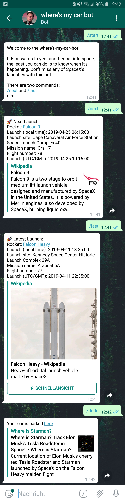

# Where's my car? bot

If Elon wants to yeet another car into space, the least you can do is to know when it's happening. Don't miss any of SpaceX's launches with this bot.

 
  <a href="https://t.me/wheresmycar_bot">Try me!</a>
    
  

This projects uses the public [SpaceX-API](https://github.com/r-spacex/SpaceX-API) and has been forked from [this guy's bot](https://github.com/matteomeneghetti/SpaceX-Launches-Bot).
